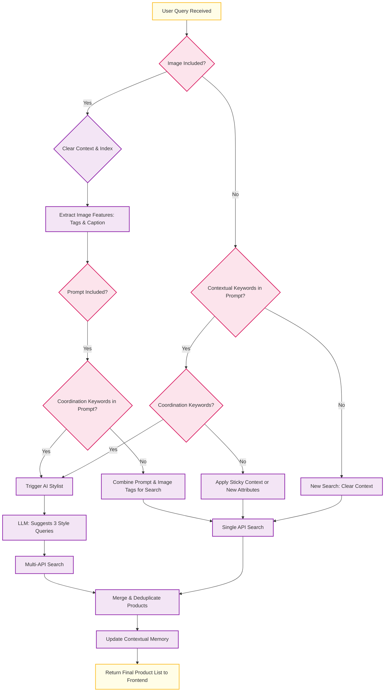

# ShopSmarter AI 🛍️

A sophisticated, conversational AI shopping assistant that helps users find products, get style recommendations, and build outfits through a modern chat interface.

## Core Features

### 🧠 Advanced Conversational AI

ShopSmarter is more than just a search tool; it's a shopping companion that understands context and learns from your conversation.

#### 1. Conversational Memory & Context

The bot remembers what you've searched for, allowing for natural follow-up questions. This "sticky context" makes the conversation fluid and intuitive.

> **Example:**
> 1.  **You:** _(Searches for "plain black t-shirt")_
> 2.  **Bot:** _(Shows a list of plain black t-shirts)_
> 3.  **You:** "show me more"
> 4.  **Bot:** _(Understands you still want "plain black t-shirts" and gets more results)_
> 5.  **You:** "how about in white"
> 6.  **Bot:** _(Understands the new attribute, searches for "plain white t-shirt")_

#### 2. AI-Powered Outfit Building & Styling

This is the standout feature. The bot can act as a personal stylist, suggesting items that complement what you've already found.

> **Example:**
> 1.  **You:** _(Searches for a "red t-shirt")_
> 2.  **Bot:** _(Shows red t-shirts)_
> 3.  **You:** "show me some jeans that would go well with that"
> 4.  **Bot:** _(Uses its Language Model to brainstorm stylish combinations. It might search for "blue denim jeans", "black slim-fit jeans", and "light-wash relaxed jeans", then shows you the combined results.)_

### 📷 Multimodal Search

Combine images and text to get precisely what you're looking for.

-   **Image Search**: Upload a photo to find visually similar items.
-   **Text Search**: Describe what you want.
-   **Image + Text Search**: Upload an image and refine your search with text (e.g., upload a photo of jeans and type "show me a jacket in this colour").

### 🛒 Interactive Shopping Cart

A fully functional cart allows you to save items you're interested in.
- **Add to Cart**: Save items directly from the chat results.
- **Cart View**: Click the cart icon to open a modal window displaying all your saved items in a clean, two-column grid.


## Technical Flowchart: The Brains of ShopSmarter

This flowchart illustrates the entire backend decision-making process for a user query.



## Technologies Used

- **Backend**: Python, Flask, Llama-cpp-python, Transformers, Sentence-Transformers, FAISS
- **Frontend**: React.js
- **APIs**: RapidAPI for e-commerce data (Amazon, Flipkart)
- **ML Models**:
    - **CLIP (`openai/clip-vit-base-patch32`)**: For powerful image-text embeddings.
    - **BLIP (`Salesforce/blip-image-captioning-base`)**: For generating descriptive captions from images.
    - **TinyLlama (or similar GGUF model)**: For CPU-friendly LLM tasks like styling and refinement.

## Setup and Run Locally

**1. Clone the Repository**

```bash
git clone <your-repository-url>
cd shopsmarter
```

**2. Set Up Backend (Python)**

-   Navigate to the `backend/` directory.
-   Create and activate a Python virtual environment.
    ```bash
    python3 -m venv venv
    source venv/bin/activate
    ```
-   Install dependencies:
    ```bash
    pip install -r ../requirements.txt
    ```
-   Download a GGUF-compatible LLM model (e.g., from TinyLlama on Hugging Face) and place it in the `backend/models` directory.
-   Create a `.env` file in `backend/` using `.env.sample` as a template and fill in your RapidAPI key and model path.

**3. Set Up Frontend (React)**

-   Navigate to the `frontend/` directory.
-   Install dependencies:
    ```bash
    npm install
    ```

**4. Run the Application**

-   **Terminal 1 (Backend):**
    ```bash
    cd backend
    flask run
    ```
-   **Terminal 2 (Frontend):**
    ```bash
    cd frontend
    npm start
    ```
The application will open at `http://localhost:3000`.

## License

This project is licensed under the MIT License. 