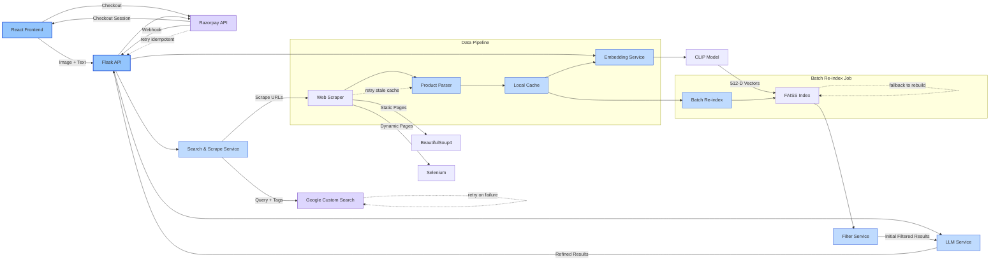

# ShopSmarter System Architecture

## Component Details

1. **Frontend (React)**
   - Image upload via drag-and-drop
   - Text query input
   - Product carousel display
   - Cart management
   - Razorpay checkout integration

2. **Backend (Flask)**
   - RESTful API endpoints under `/api`
   - Service orchestration and error handling
   - Webhook handling with signature verification and retry logic

3. **Search & Scrape Service**
   - Combines CLIP-predicted tags and user prompt for Google Custom Search
   - Multi-strategy scraping (requests + BS4, Selenium fallback)
   - Product parsing with retries for stale cache

4. **Embedding Service**
   - CLIP model inference on images
   - FAISS index build, search, and fallback re-index

5. **Filter Service**
   - Applies price, style, color, and exclusion filters before LLM refinement

6. **LLM Service**
   - Extracts filter criteria and re-ranks via two `LLMChain` passes
   - Runs on CPU with batch retries for improved accuracy

7. **External Services**
   - Razorpay for payments (checkout sessions & webhooks)
   - Google Custom Search for product discovery
   - E-commerce websites as data sources

This diagram shows data flow, retry/error annotations, and a scheduled batch re-index job to keep the FAISS index up-to-date.
